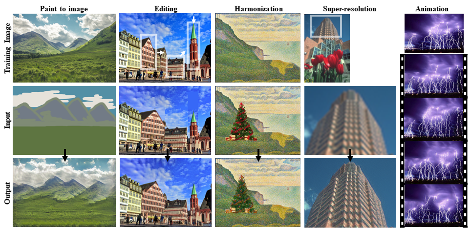

# SinGAN
[Project](http://webee.technion.ac.il/people/tomermic/SinGAN/SinGAN.htm) | [Arxiv](https://arxiv.org/pdf/1905.01164.pdf) | [CVF](http://openaccess.thecvf.com/content_ICCV_2019/papers/Shaham_SinGAN_Learning_a_Generative_Model_From_a_Single_Natural_Image_ICCV_2019_paper.pdf) 
### Official pytorch implementation of the paper: "SinGAN: Learning a Generative Model from a Single Natural Image"


## Random samples from a *single* image
With SinGAN, you can train a generative model from a single natural image, and then generate random samples form the given image, for example:


## SinGAN's applications
SinGAN can be also use to a line of image manipulation task, for example:
 
This is done by injecting an image to the already trained model. See section 4 in our [paper](https://arxiv.org/pdf/1905.01164.pdf) for more details.


## Code

### Install dependencies

```
python -m pip install -r requirements.txt
```

This code was tested with python 3.6  

###  Train
To train SinGAN model on your own image, put the desire training image under Input/Images, and run

```
python main_train.py --input_name <input_file_name>
```
Need to put the training video into Input/Images

This will also use the resulting trained model to generate random samples starting from the coarsest scale (n=0).

To run this code on a cpu machine, specify `--not_cuda` when calling `main_train.py`

###  Random samples
To generate random samples from any starting generation scale, please first train SinGAN model for the desire image (as described above), then run 

```
python random_samples.py --input_name <training_image_file_name> --mode random_samples --gen_start_scale <generation start scale number>
```

pay attention: for using the full model, specify the generation start scale to be 0, to start the generation from the second scale, specify it to be 1, and so on. 


###  Animation from a single image

To generate short animation from a single image, run

```
python animation.py --input_name <input_file_name> 
```

This will automatically start a new training phase with noise padding mode.


### Super Resolution
To super resolve an image, please run:
```
python SR.py --input_name <LR_image_file_name>
```
This will automatically train a SinGAN model correspond to 4x upsampling factor (if not exist already).
For different SR factors, please specify it using the parametr `--sr_factor` when calling the function.
SinGAN's results on BSD100 dataset can be download from the 'Downloads' folder.


### Super Resolution Results
SinGAN's SR results on BSD100 dataset can be download from the 'Downloads' folder.


